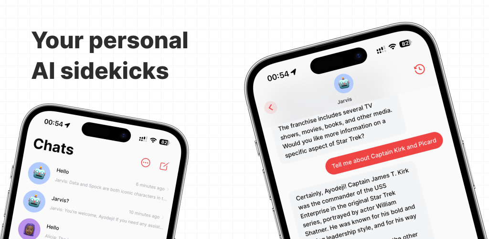

Sidekyk was a project I worked on last year to ride the AI wave (yes, that was its purpose, it wasn't some deep passion project) but [never released](https://twitter.com/trulyao/status/1704530681475305891) publicly partly because Apple was being hard to play ball with and partly because I was simply tired of working on it (especially since I used AI less and less and OpenAI also came along with their app which was fine for the occasional use for most people). I am now open-sourcing this horrible codebase after some modifications (removing a lot of third-party dependencies like Stripe, Sentry, Logsnag, allowing you use SQLite as the database etc) so that it can be self-hosted and development can continue should anyone desire to keep using the application, please see the license before proceeding to make any sort of modification.

> [!NOTE]
> A lot of the planned features like voice interactions never made it into what you are looking at which was supposed the 1.0-kind-of-beta version.

## Self-hosting the API

**TODO**

## Building the mobile application

**TODO**
